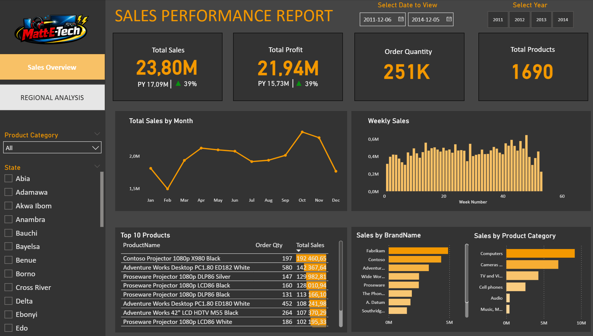
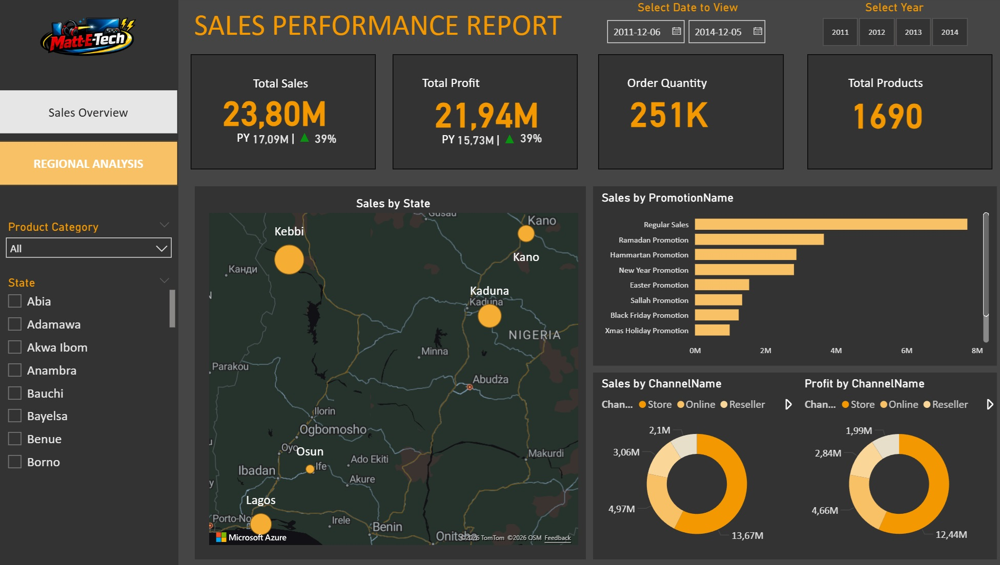

# sales_analysis_powerbi_electronics_store
Power BI sales performance dashboard using custom data model, DAX measures (including variables), Date Table and interactive visual design for retail and online sales analytics.
## 🎯 Project Goal

The goal of this project was to design a business oriented sales dashboard that enables leadership to monitor KPIs, evaluate profitability, and identify performance drivers.
Rather than focusing purely on visuals, the report was structured to answer key commercial questions and simulate a real world decision support environment.

## 📊 Data Source

The dataset used in this project was simulated for educational and portfolio purposes.  
It does not represent real company data.

The dataset consists of two primary tables: a transactional sales table and a product dimension table. It was synthetically generated to simulate a retail electronics sales environment.

### Sales (Fact Table)

Contains transaction-level sales records.  
Each row represents a single order.

Key fields:
- Order Number – unique transaction identifier  
- Sales Date – transaction date  
- Sales Channel – distribution channel (Online, In-Store, Wholesale)  
- Productindex – product reference key  
- Order qty – quantity sold  
- Unit price – selling price per unit  
- Unit cost – cost per unit  
- Sales – total revenue per transaction  

This table serves as the analytical core for revenue, cost, and profitability calculations.

---

### Products (Dimension Table)

Contains descriptive information about products.

Key fields:
- Index – product identifier  
- Product Name – product description  
- Product Category – product classification  

This table enables categorical analysis and segmentation of sales performance.

## 🛠 Tools & Technologies

**Excel**  
Dataset preparation, data cleaning, structuring, and validation before import into the BI environment.

**Power BI**  
Data modeling (relationships, star schema structure), DAX measure development, KPI calculations, and interactive dashboard design to support business analysis.

**AI Assisted Design (ChatGPT)**  
Generated visual branding assets (logo) for portfolio presentation purposes.


## Data Preparation & Modeling

**Excel – Data Quality Checks**

Before importing the dataset into Power BI, a preliminary data quality check was performed in Excel to ensure consistency and reliability.
The following validations were completed:
Missing values check in key columns (Sales Date, Sales, Cost, Order Quantity, Sales Channel).

Data type verification:

- Dates formatted as Date
- Numeric fields (Sales, Cost, Unit Price) as Decimal Number
- Quantities as Whole Number
- Identifiers (Order Number) as Text
- Logical consistency validation (e.g., no negative quantities or unrealistic values).
- The objective was to ensure clean, structured input data before building the analytical model in Power BI.

**Power BI – Date Table Creation (Time Intelligence Foundation)**

A dedicated Date Table was created to:

- Enable proper time-based filtering
- Support Year / Quarter / Month hierarchies
- Allow accurate Year-over-Year (YoY) comparisons
- Improve model performance and analytical flexibility

DAX – Date Table

This table acts as the central time dimension for the data model and enables Power BI time intelligence functions.

```DAX

DATES = ADDCOLUMNS(CALENDAR(DATE(2011,12,6), DATE(2014,12,5)),
"Year", YEAR([DATE]),
"Quarter", FORMAT([Date], "\QQ"),
"Month", FORMAT([Date], "mmm"),
"MonthNum", MONTH([Date]),
"Day of Week", WEEKDAY([Date]),
"Day Of Week Num", WEEKNUM([Date]),
"DayName", FORMAT([Date], "dddd"))
```

**Core Measures – Sales, Profit & Year-over-Year Analysis**

The following DAX measures were created to calculate key performance indicators.
Base Measures

These measures retrieve the previous year's values dynamically based on the current filter context.

```
Total Profit = SUM(SalesData[Sales]) - SUM(SalesData[Cost])
Total Sales = SUM(SalesData[Sales])
```

These measures calculate the percentage growth compared to the previous year, allowing trend performance evaluation.
```
Year-over-Year Growth (%)
Profit_YoY% = 
VAR __PREV_YEAR = CALCULATE([Total Profit], DATEADD('DATES'[Date], -1, YEAR))

RETURN
	DIVIDE([Total Profit] - __PREV_YEAR, __PREV_YEAR)
	
Sales_YoY% = 
VAR __PREV_YEAR = CALCULATE([Total Sales], DATEADD('DATES'[Date], -1, YEAR))
RETURN
	DIVIDE([Total Sales] - __PREV_YEAR, __PREV_YEAR)
```


**Conditional Formatting – KPI Visual Indicators**

To enhance dashboard readability and executive interpretation, visual indicators were added.
These measures dynamically display visual cues (▲ / ▼ and green/red color), allowing users to instantly understand performance direction.


Profit – Icon & Color Logic

RETURN Result

```
Profit_Icon = 
VAR PositiveIcon = UNICHAR(9650)
VAR NegativeIcon = UNICHAR(9660)
VAR Result = IF([Profit_YoY%]>0, PositiveIcon, NegativeIcon)


Profit_Icon_Color = IF([Profit_YoY%] > 0, "Green", "Red")
```

Sales – Icon & Color Logic

These measures dynamically display visual cues (▲ / ▼ and green/red color), allowing users to instantly understand performance direction.

RETURN Result
```
Sales_Icon = 
VAR PositiveIcon = UNICHAR(9650)
VAR NegativeIcon = UNICHAR(9660)
VAR Result = IF([Sales_YoY%]>0, PositiveIcon, NegativeIcon)

Sales_Icon_Color = IF([Sales_YoY%] > 0, "Green", "Red")
```

Exploratory Business Analysis (Power BI)

The visualization was conducted directly in Power BI using interactive dashboards.
The goal was to identify revenue patterns, profitability drivers, regional performance, and channel efficiency.


🧾 Page 1 – Sales Overview



Analysis Focus

- Total Sales and Total Profit performance
- Year-over-Year growth comparison
- Monthly revenue trend
- Weekly sales distribution
- Top-performing products
- Brand and category contribution

Key Insights

- Revenue reached 23.8M, reflecting a 39% YoY increase.
- Profit growth aligns with revenue growth, indicating stable margins.
- October and November show peak seasonal performance.
- A small number of products drive a disproportionate share of total revenue.
- Computers and Cameras represent the dominant product categories.

🌍 Page 2 – Regional & Channel Analysis



Analysis Focus

- Sales distribution by state
- Revenue contribution by promotion type
- Channel-level sales and profit breakdown

Key Insights

- Sales concentration is geographically clustered in high-density states.
- Regular Sales significantly outperform promotional campaigns.
- Online channel generates the highest revenue share.
- Profit distribution mirrors channel revenue structure, confirming consistent margin behavior.

📌 Summary of Exploratory Findings

- Business growth is consistent and scalable.
- Revenue expansion is driven primarily by channel performance and product concentration.
- Margin structure remains stable across periods.
- Digital sales channel represents the dominant revenue stream.
- Seasonal peaks indicate demand concentration in Q4.

