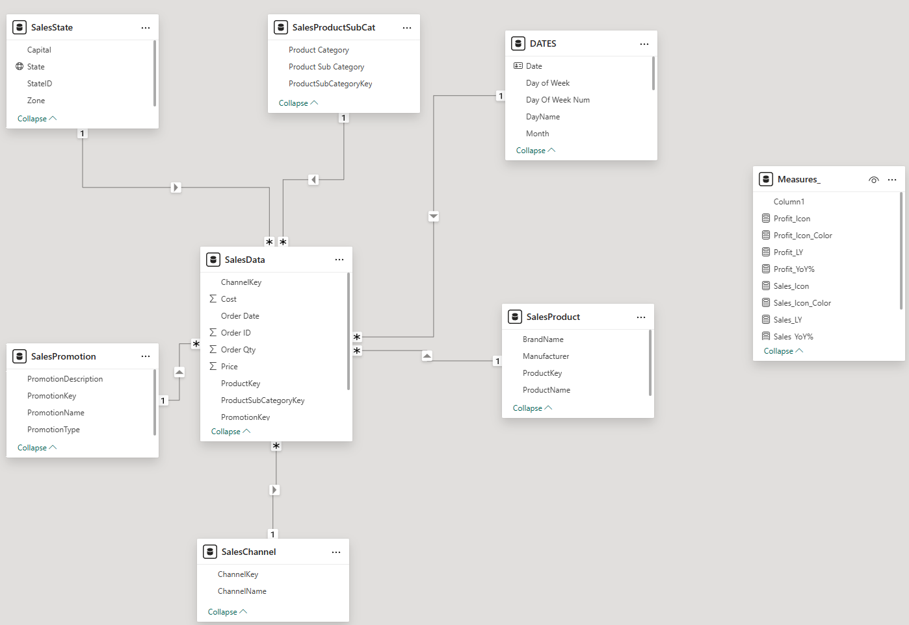
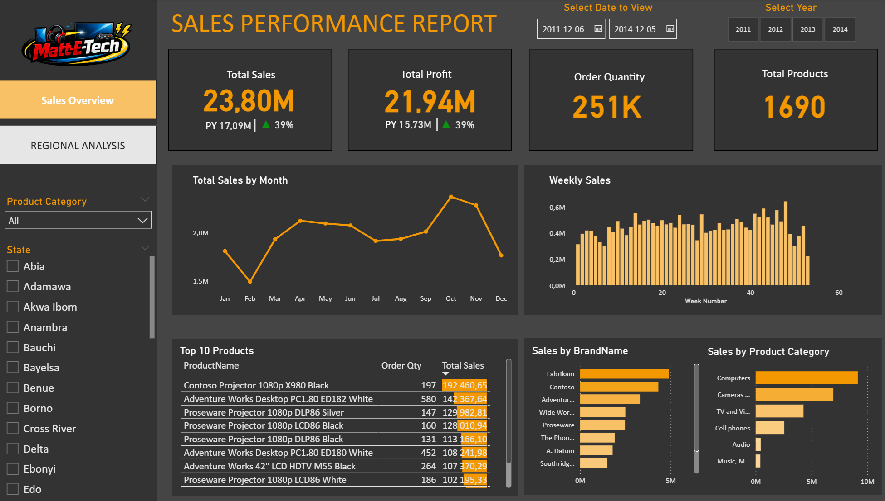
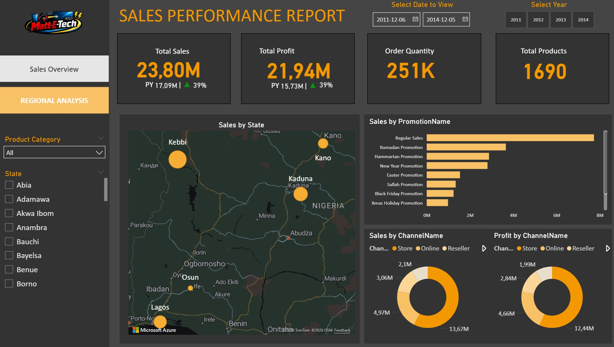

# sales_analysis_powerbi_electronics_store
Power BI sales performance dashboard using custom data model, DAX measures (including variables), Date Table and interactive visual design for retail and online sales analytics.
## 🎯 Project Goal

## 🎯 Project Goal

This project shows how retail sales data can be transformed into clear, actionable business insights using Power BI.
The analysis focuses on understanding sales performance, product profitability, and customer behavior to support better business decisions. It reflects a real-world analytical approach used in retail environments, from data preparation to final dashboard creation.


## 📑 Table of Content
- [Data Source](#-data-source)
- [Data Preparation & Modeling](#-data-preparation--modeling)
- [ER Diagram](#-er-diagram)
- [Exploratory Business Analysis (Power BI)](#-exploratory-business-analysis-power-bi)
- [Business Insights & Conclusions](#-business-insights--conclusions)
- [Business Recommendations](#-business-recommendations)
 

## 📊 Data Source

The dataset used in this project is fully simulated and created for portfolio purposes.
It represents a typical retail sales structure, including transactions, products, and customer-related information. While the data is not real, it closely reflects real-world business scenarios and analytical workflows.

### Sales (Fact Table)

Contains transaction level sales records.  
Each row represents a single order.

Key fields:
- Order Number – unique transaction identifier  
- Sales Date – transaction date  
- Sales Channel – distribution channel (Online, Store, Wholesale)  
- Productindex – product reference key  
- Order qty – quantity sold  
- Unit price – selling price per unit  
- Unit cost – cost per unit  
- Sales – total revenue per transaction  

This table serves as the analytical core for revenue, cost, and profitability calculations.

---

### Products (Dimension Table)

Contains descriptive information about products.

Key fields:
- Index – product identifier  
- Product Name – product description  
- Product Category – product classification  

This table enables categorical analysis and segmentation of sales performance.

## 🛠 Tools & Technologies

**Excel**  
Dataset preparation, data cleaning, structuring, and validation before import into the BI environment.

**Power BI**  
Data modeling (relationships, star schema structure), DAX measure development, KPI calculations, and interactive dashboard design to support business analysis.

**AI Assisted Design (ChatGPT)**  
Generated visual branding assets (logo) for portfolio presentation purposes.


## 🧱🧹 Data Preparation & Modeling

**Excel – Data Quality Checks**

Before importing the dataset into Power BI, a preliminary data quality check was performed in Excel to ensure consistency and reliability.
The following validations were completed:
Missing values check in key columns (Sales Date, Sales, Cost, Order Quantity, Sales Channel).

Data type verification:

- Dates formatted as Date
- Numeric fields (Sales, Cost, Unit Price) as Decimal Number
- Quantities as Whole Number
- Identifiers (Order Number) as Text
- Logical consistency validation (no negative quantities or unrealistic values).
- The objective was to ensure clean, structured input data before building the analytical model in Power BI.

**Power BI – Date Table Creation (Time Intelligence Foundation)**

A dedicated Date Table was created to:

- Enable proper time based filtering
- Support Year / Quarter / Month hierarchies
- Allow accurate Year-over-Year (YoY) comparisons
- Improve model performance and analytical flexibility

DAX – Date Table

This table acts as the central time dimension for the data model and enables Power BI time intelligence functions.

DAX

```
DATES = ADDCOLUMNS(CALENDAR(DATE(2011,12,6), DATE(2014,12,5)),
"Year", YEAR([DATE]),
"Quarter", FORMAT([Date], "\QQ"),
"Month", FORMAT([Date], "mmm"),
"MonthNum", MONTH([Date]),
"Day of Week", WEEKDAY([Date]),
"Day Of Week Num", WEEKNUM([Date]),
"DayName", FORMAT([Date], "dddd"))
```

**Core Measures – Sales, Profit & Year-over-Year Analysis**

The following DAX measures were created to calculate key performance indicators.
Base Measures

These measures retrieve the previous year's values dynamically based on the current filter context.

```
Total Profit = SUM(SalesData[Sales]) - SUM(SalesData[Cost])
Total Sales = SUM(SalesData[Sales])
```

These measures calculate the percentage growth compared to the previous year, allowing trend performance evaluation.

```
Year-over-Year Growth (%)
Profit_YoY% = 
VAR __PREV_YEAR = CALCULATE([Total Profit], DATEADD('DATES'[Date], -1, YEAR))

RETURN
	DIVIDE([Total Profit] - __PREV_YEAR, __PREV_YEAR)
	
Sales_YoY% = 
VAR __PREV_YEAR = CALCULATE([Total Sales], DATEADD('DATES'[Date], -1, YEAR))
RETURN
	DIVIDE([Total Sales] - __PREV_YEAR, __PREV_YEAR)
```


**Conditional Formatting – KPI Visual Indicators**

To enhance dashboard readability and executive interpretation, visual indicators were added.
These measures dynamically display visual cues (▲ / ▼ and green/red color), allowing users to instantly understand performance direction.


Profit – Icon & Color Logic

RETURN Result

```
Profit_Icon = 
VAR PositiveIcon = UNICHAR(9650)
VAR NegativeIcon = UNICHAR(9660)
VAR Result = IF([Profit_YoY%]>0, PositiveIcon, NegativeIcon)


Profit_Icon_Color = IF([Profit_YoY%] > 0, "Green", "Red")
```

Sales – Icon & Color Logic

These measures dynamically display visual cues (▲ / ▼ and green/red color), allowing users to instantly understand performance direction.

RETURN Result
```
Sales_Icon = 
VAR PositiveIcon = UNICHAR(9650)
VAR NegativeIcon = UNICHAR(9660)
VAR Result = IF([Sales_YoY%]>0, PositiveIcon, NegativeIcon)

Sales_Icon_Color = IF([Sales_YoY%] > 0, "Green", "Red")
```


## 🔗 ER Diagram

The data model follows a Star Schema architecture, designed to ensure scalability, clarity, and optimized performance within Power BI.
At the center of the model is the SalesData fact table, connected to multiple dimension tables through one to many relationships.




## 📊 Exploratory Business Analysis (Power BI)

The visualization was conducted directly in Power BI using interactive dashboards.
The goal was to identify revenue patterns, profitability drivers, regional performance, and channel efficiency.


🧾 Page 1 – Sales Overview



🔎 Analysis Focus

- Total Sales and Total Profit performance
- Year-over-Year growth comparison
- Monthly revenue trend
- Weekly sales distribution
- Top performing products
- Brand and category contribution

💡 Key Insights

- Revenue reached 23.8M, reflecting a 39% YoY increase.
- Profit growth aligns with revenue growth, indicating stable margins.
- October and November show peak seasonal performance.
- A small number of products drive a disproportionate share of total revenue.
- Computers and Cameras represent the dominant product categories.


🌍 Page 2 – Regional & Channel Analysis



🔎 Analysis Focus

- Sales distribution by state  
- Revenue contribution by promotion type  
- Channel-level sales and profit performance  

💡 Key Insights

- Sales are geographically concentrated in high density states.  
- Regular sales significantly outperform promotional campaigns.  
- The Online channel generates the highest revenue share.  
- Profit distribution aligns with revenue structure, indicating stable margins.  


## 📝 Business Insights & Conclusions


## 📝 Business Insights & Conclusions

- The analysis highlights a strong and scalable business model supported by consistent growth and stable profitability.
- Revenue reached 23.8M, reflecting a solid 39% Year-over-Year increase. Profit growth remains aligned with revenue, confirming controlled and sustainable margin performance.
- Sales are heavily concentrated in a limited number of top-performing products and categories. While this drives strong results, it also introduces a level of dependency on key assortment segments.
- The Online channel clearly dominates revenue generation, significantly outperforming other channels and indicating where future growth potential is concentrated.
- Seasonality plays an important role, with visible acceleration in Q4. This suggests demand peaks during key commercial periods and should be reflected in planning and inventory decisions.
- Promotional campaigns support overall performance, but regular sales remain the primary revenue driver, indicating a relatively healthy pricing structure.
- From a strategic perspective, the business demonstrates scalable growth, strong channel performance, and stable margins, with clear opportunities for further optimization.


### 🔑 Key Takeaways

- 23.8M revenue with 39% YoY growth  
- Stable and controlled margin performance  
- Strong dependency on top-performing products  
- Online channel as the main growth driver  
- Q4 as a key revenue peak period  

### 💼 Optimization Opportunities

- Strong reliance on the Online channel as the primary revenue driver  
- Promotional campaigns show lower relative impact compared to regular sales  
- High dependency on top performing products and categories  
- Sales performance is strongly influenced by seasonal demand peaks  

## 💼 Business Recommendations

- Increase investment in the Online channel to support further growth  
- Refine promotional strategy to improve efficiency and ROI  
- Reduce dependency on top performing products by expanding the assortment  
- Identify growth opportunities in underperforming regions based on sales data  
